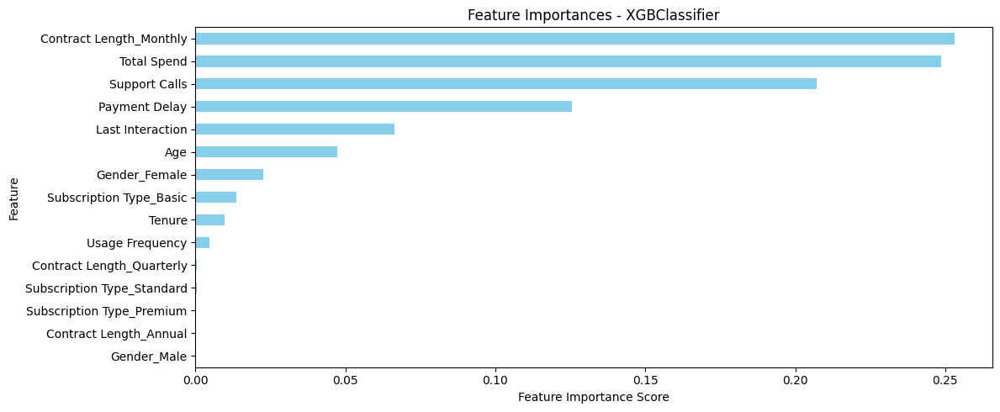
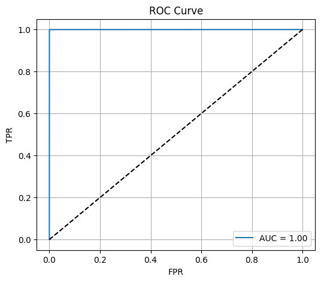

📊 Customer Churn Prediction

A machine learning project to predict customer churn using structured data. The goal is to build a reliable model that performs well both on synthetic training data and real-world data with different distributions.

---

📁 Project Structure
```bash
CUSTOMER_CHURN/
├── data/                   # Raw and preprocessed datasets
├── notebook/               # Exploratory data analysis and model experiments
│   ├── EDA_Train_Dataset.ipynb
│   ├── EDA_Test_Dataset.ipynb
│   ├── build_model.ipynb   # Training multiple models (XGBoost, CatBoost, LightGBM)
│   └── catboost_info/      # CatBoost logs
├── src/                    # Source code
│   ├── data/               # (optional submodules for data loading/prep)
│   ├── models/
│   │   ├── train_model.py  # Model training scripts
│   │   └── XGBClassifier.joblib  # Final saved model (XGBoost)
│   ├── utils/              # Utility functions
│   │   ├── init.py
│   
│   ├── preprocess.py       # Preprocessing logic (used in pipeline)
|   ├── main.py
├── README.md               # Project documentation
├── requirments.txt         # Project dependencies


---

✅ Project Summary

Performed EDA on both synthetic (train_df) and real-world (real_df) datasets using separate notebooks.

Trained and compared three models:

XGBoost

CatBoost

LightGBM


Selected XGBoost as the final model due to its superior performance on real data.

Designed a scikit-learn pipeline to integrate preprocessing and modeling.

Saved the final trained model using joblib.


---

🛠 Workflow Overview

1. Exploratory Data Analysis
Performed in the notebook/ folder separately for both datasets.


2. Model Training & Evaluation

Initial training was done on synthetic data.

Real data had a different distribution, so the model was fine-tuned on 50% of the real dataset.

This improved accuracy on real data while sacrificing some accuracy on the synthetic dataset (acceptable tradeoff).

## 📊 Evaluation Results

### Confusion Matrix


### Feature Importances


### ROC Curve



3. Final Model Pipeline

Preprocessing (categorical encoding, scaling)

Model: XGBoost

Saved using joblib for later inference


---

🔧 Dependencies

In requirments.txt:

pandas>=1.3
numpy>=1.21
scikit-learn>=1.0
xgboost>=1.6
joblib>=1.1

> You can install dependencies via:


pip install -r requirments.txt


---

🚀 How to Run

import joblib
model = joblib.load('src/models/XGBClassifier.joblib')
preds = model.predict(X_new)
