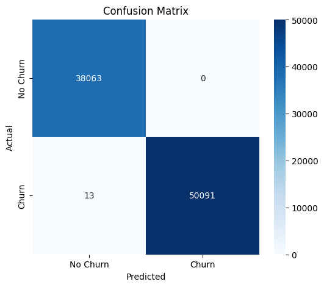
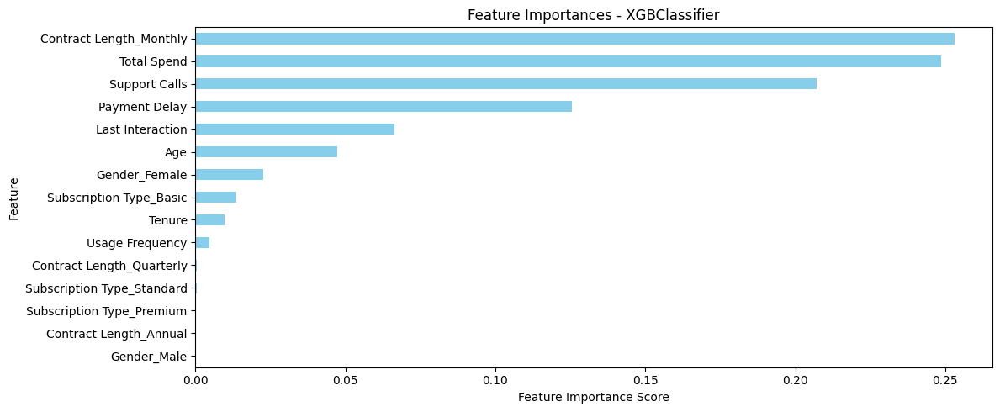
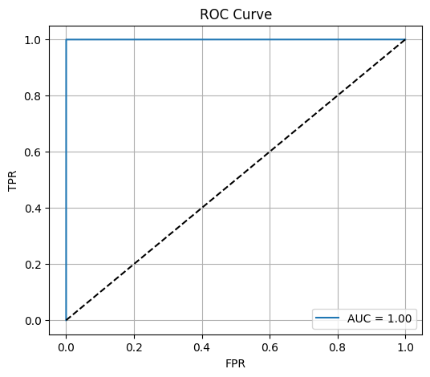

> End-to-end Machine Learning project with **FastAPI** and **Docker**, predicting customer churn with production-ready deployment.

---

## 🌐 Live Demo

The project is fully deployed and accessible online:

👉 **[Try it Live on Railway 🚀](https://churn-prediction-production-6108.up.railway.app)**

You can open the link, enter customer information, and see real-time predictions directly in your browser.

---

# 📊 Customer Churn Prediction

A machine learning project to predict customer churn using structured data.  
The goal is to build a reliable model that performs well both on synthetic training data and real-world data with different distributions.

---

## 📁 Project Structure
```bash
CUSTOMER_CHURN/
├── data/                   # Raw and preprocessed datasets
├── notebook/               # Exploratory data analysis and model experiments
│   ├── EDA_Train_Dataset.ipynb
│   ├── EDA_Test_Dataset.ipynb
│   ├── build_model.ipynb   # Training multiple models (XGBoost, CatBoost, LightGBM)
│   └── catboost_info/      # CatBoost logs
├── src/                    # Source code
│   ├── data/               # (optional submodules for data loading/prep)
│   ├── models/
│   │   ├── train_model.py  # Model training scripts
│   │   └── XGBClassifier.joblib  # Final saved model (XGBoost)
│   ├── utils/              # Utility functions
│   │   ├── __init__.py
│   ├── preprocess.py       # Preprocessing logic (used in pipeline)
│   ├── main.py
├── README.md               # Project documentation
├── requirements.txt        # Project dependencies
├── Dockerfile              # Docker configuration
├── ml_fastapi.py           # FastAPI app for serving predictions
└── sample.json             # Example request for API

```

## ✅ Project Summary
Performed EDA on both synthetic (train_df) and real-world (real_df) datasets using separate notebooks.

Trained and compared three models:

XGBoost

CatBoost

LightGBM

Selected XGBoost as the final model due to its superior performance on real data.

Designed a scikit-learn pipeline to integrate preprocessing and modeling.

Saved the final trained model using joblib.

## 🛠 Workflow Overview
1. Exploratory Data Analysis
Performed in the notebook/ folder separately for both datasets.

2. Model Training & Evaluation
Initial training was done on synthetic data.

Real data had a different distribution, so the model was fine-tuned on 50% of the real dataset.

This improved accuracy on real data while sacrificing some accuracy on the synthetic dataset (acceptable tradeoff).

## 📊 Evaluation Results
Confusion Matrix


Feature Importances


ROC Curve


## 🔎 Insights from Feature Importances
Contract Length (Monthly) and Total Spend are by far the most influential features.

Support Calls also plays a major role → customers who frequently contact support are more likely to leave.

Payment Delay is another key churn driver.

Behavioral variables like Last Interaction and Age have moderate importance.

Demographic and subscription-type variables (e.g., Basic, Standard, Premium, Gender) had relatively low predictive power.

## 🔧 Dependencies
In requirements.txt:
```bash
fastapi
uvicorn
scikit-learn==1.6.1
xgboost
pandas
numpy
matplotlib
joblib
```

Install dependencies:
```bash
pip install -r requirements.txt
```

## 🚀 How to Run (Locally)
```python
import joblib
model = joblib.load('src/models/XGBClassifier.joblib')
preds = model.predict(X_new)
```
Or run API locally:
```bash
uvicorn ml_fastapi:app --host 0.0.0.0 --port 8000
```
## 🐳 Dockerization
This project is fully containerized with Docker.

Build the Docker image
```bash
docker build -t customer_churn .
```
Run the container
```bash
docker run -d -p 8000:8000 customer_churn
```
The API will now be available at:
```bash
http://localhost:8000
```
## 📡 API Usage
The FastAPI app exposes endpoints for prediction.

Here you can test the API using Swagger UI.

Sample Request
POST /predict
```json
{
  "Age": 30,
  "Gender": "Female",
  "Tenure": 39,
  "Usage_Frequency": 14,
  "Support_Calls": 5,
  "Payment_Delay": 18,
  "Subscription_Type": "Standard",
  "Contract_Length": "Annual",
  "Total_Spend": 932,
  "Last_Interaction": 17
}
```
Sample Response
```json
{
    "churn_prediction": 1,
    "churn_probability": [
        5.960464477539062e-07,
        0.9999994039535522
    ]
}
```
churn_prediction: 1 → customer likely to churn, 0 → customer will stay

churn_probability: probability distribution over classes

## 📦 Deployment
This container can be deployed on:

Docker Hub (for sharing)

Kubernetes (for scaling)

Cloud providers like AWS, GCP, Azure
